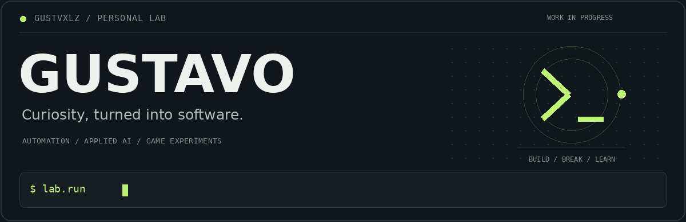

<p align="center">
  <a href="https://github.com/gustvxlz?tab=repositories"><b>explore the lab</b></a>
  &nbsp; / &nbsp;
  <a href="mailto:gustvxlz1@gmail.com">get in touch</a>
</p>

<br>

### A practical problem. A weird idea. Something to build.

I'm Gustavo, from Brazil. I build tools for repetitive work and experiment with applied AI and game development. Most projects start with a question: **“Can I make the computer do this instead?”**

My direction is **MLOps**. Right now, I'm learning by building, testing and improving projects that I can actually use.

`Python` &nbsp; `JavaScript` &nbsp; `Three.js` &nbsp; `Automation` &nbsp; `OCR`

<br>

## Selected builds

<table>
<tr>
<td width="50%" valign="top">
<h3>01 / Suite de Produção</h3>
<p>Excel workflows with less manual work. Extract production reports, match products and review entries before saving.</p>
<p><code>Python</code> <code>Tkinter</code> <code>Excel</code></p>
<a href="https://github.com/gustvxlz/suite-producao"><b>Explore the project →</b></a>
</td>
<td width="50%" valign="top">
<h3>02 / Holerites + OCR</h3>
<p>Turn batches of payroll PDFs into individual, named files. OCR, CSV matching and ZIP export in the browser.</p>
<p><code>JavaScript</code> <code>OCR</code> <code>PDF</code></p>
<a href="https://github.com/gustvxlz/separador-holerites-ocr"><b>Explore the project →</b></a>
</td>
</tr>
<tr>
<td width="50%" valign="top">
<h3>03 / TextureFlow</h3>
<p>Neural texture upscaling for older DirectX games. An experiment in improving detail while preserving the original look.</p>
<p><code>Applied AI</code> <code>Graphics</code> <code>Textures</code></p>
<a href="https://github.com/gustvxlz/TextureFlow"><b>Explore the project →</b></a>
</td>
<td width="50%" valign="top">
<h3>04 / DISORDER</h3>
<p>Office comedy that turns into a stylized zombie FPS. A playground for gameplay, 3D graphics and controlled chaos.</p>
<p><code>JavaScript</code> <code>Three.js</code> <code>Vite</code></p>
<a href="https://github.com/gustvxlz/disorder"><b>Explore the project →</b></a>
&nbsp; · &nbsp;
<a href="https://gustvxlz.github.io/disorder/">Play in the browser</a>
</td>
</tr>
</table>

<br>

## What connects the projects

**Automation** gives me time back. **Applied AI** lets me test new possibilities. **Games** give me room to experiment with things that don't belong in an office spreadsheet.

Different projects, the same habit: start with something interesting, build a version, find what breaks, improve it.

<br>

<details>
<summary><b>Open the field notes ↗</b></summary>

<br>

```text
current direction   MLOps
working languages   Python · JavaScript
interests           automation · applied AI · graphics
approach            prototype → test → improve
```

These repositories include experiments and works in progress. Their READMEs explain the current scope, limitations and how to run them.

</details>

<br>

---

<p align="center"><samp>built from curiosity. improved by doing.</samp></p>
